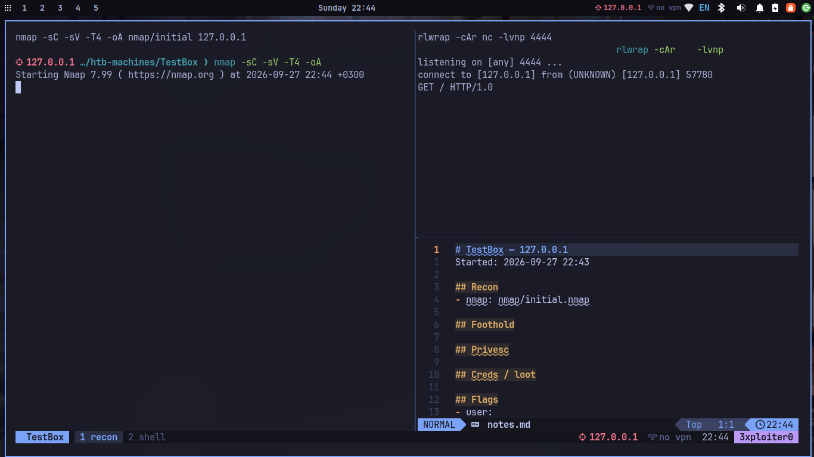
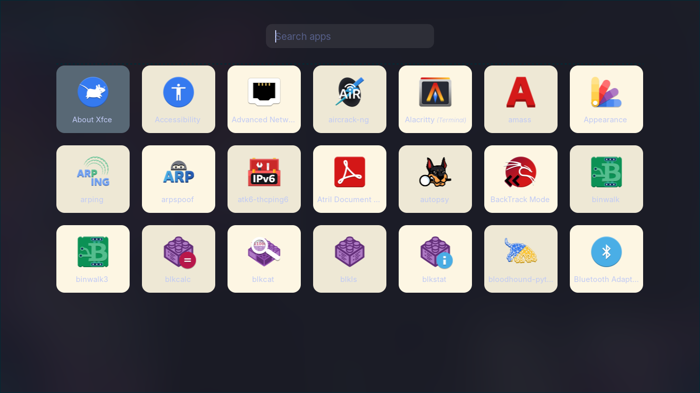
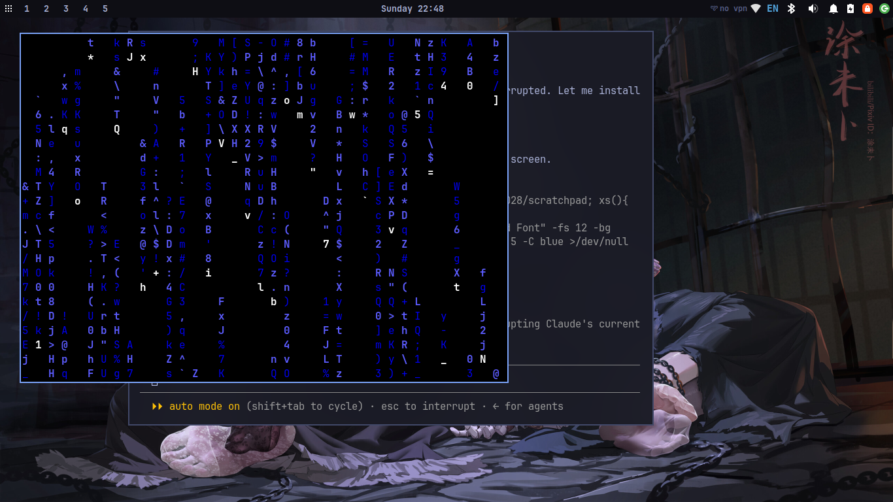

# 🐉 3xploiter0 rice — Tokyo Night Kali

A complete **Tokyo Night** rice for **Kali Linux (XFCE)** with a full **hacking workflow** baked in — installed with one command.

Themed desktop, macOS-style feels, animated eye candy, and a pentest toolkit that turns a fresh box into a working HTB/THM rig in seconds.



---

## 📖 Command reference

Every command is documented with an example in **[COMMANDS.md](COMMANDS.md)**.
In a terminal: `cheat` (quick list), `cheat <section>` (enum/ports/web/ad/crack/linux/windows…), and **`ex <command>`** to print one example — e.g. `ex payload`.

## ✨ Highlights

- **Tokyo Night everywhere** — window theme, GTK, Papirus icons, JetBrainsMono Nerd Font, themed Alacritty / QTerminal, starship prompt
- **macOS feels** — bottom dock, Launchpad (`F4`), Mission Control (`F3`), hot corners
- **Eye candy** — animated video wallpaper (`livewp`), wallpaper-driven auto-theming (`wal-cycle`), a desktop HUD (conky), window animations + blur (picom)
- **Hacking workflow** — one-command box setup, auto-recon, VPN toggle, reverse-shell generator, report builder, terminal auto-logging
- **Self-maintaining** — weekly auto-update + unattended security patches
- **Backed up + shareable** — everything lives in this repo

| Launchpad | Matrix lock |
|---|---|
|  |  |

---

## 🚀 Install

Run as your **normal user** (it uses `sudo` when needed) on Kali/XFCE:

```bash
git clone https://github.com/3xploiter0/rice-dotfiles ~/rice
cd ~/rice
./install.sh
```

- Existing configs are **backed up** to `~/.rice-restore-<date>/` first.
- **Safe install:** desktop look + terminals + toolkit. It does **not** touch GRUB, the boot splash, or the login screen.
- When it finishes: **log out and back in**, open a terminal, and run **`cheat`**.

---

## ⌨️ Commands

Run **`cheat`** any time for the full, colored list (`cheat htb`, `cheat tmux`, `cheat desktop`…), or open [`cheatsheet/rice-card.html`](cheatsheet/rice-card.html).

### Hacking workflow
| Command | Does |
|---|---|
| `vpn htb` · `vpn thm` · `vpn down` | Connect/disconnect a `.ovpn` (put files in `~/vpn/`) |
| `htb <ip> <box>` | Target + folders + tmux workspace (nmap, listener, notes) |
| `recon <ip>` | Full port scan → auto service enum (web/SMB/FTP…) |
| `recon-web <domain>` | subfinder → httpx → nuclei *(authorized scope only)* |
| `addhost <ip> <name>` | Add/remove an `/etc/hosts` entry |
| `serve` / `gettools` | HTTP file server (IP pre-filled) / stage linpeas·winpeas·pspy·chisel |
| `revshell` | Reverse shells (bash/python/php/ps…), copies to clipboard |
| `pwncat-cs -lp 4444` | Smart reverse-shell catcher (auto TTY) |
| `note "…"` · `loot <f>` | Timestamped note / grab a file into the box's `loot/` |
| `crack <hash\|file>` | Auto-detect hash type → hashcat vs rockyou |
| `report <box>` | Build a markdown pentest report from notes + logs |
| `status` | One glance: VPN, target, box, listeners, tmux |

### Desktop
| Keys | Does |
|---|---|
| `Super+Return` / `Super+Space` | Terminal / app launcher |
| `F4` / `F3` | Launchpad / Mission Control |
| `Super+Ctrl+Space` | Next wallpaper |
| `Super+1..5` / `+Shift` | Switch / move to workspace |
| `livewp on` · `wal-cycle` | Live video wallpaper · recolor from wallpaper |

---

## 🧩 What's inside

```
install.sh              one-command installer (portable, backs up first)
.zshrc .tmux.conf       shell + tmux (Tokyo Night, auto-logging)
.config/               alacritty, picom, rofi, nvim (LazyVim), conky, fastfetch, btop, cava…
.local/bin/            all the helper commands above
.local/share/          xfwm theme, icons config, qterminal/gtksourceview themes, wallpapers
xfce-xml/              panel + dock + window-manager + keybind settings
cheatsheet/            printable HTML reference card
```

Self-update: a systemd user timer runs `update` weekly (nuclei templates + config backup/push), and `unattended-upgrades` handles apt security patches.

---

## ↩️ Uninstall

```bash
cd ~/rice        # the folder you cloned into
./uninstall.sh
```

It stops the rice (picom, conky, dock, live wallpaper, weekly timer), removes the
helper commands and configs it added, and **restores your previous configs** from
the backup `install.sh` made (`~/.rice-restore-<date>/`). Log out and back in
afterwards.

Packages are left installed (they're harmless on their own); the uninstaller
prints the `apt remove` line if you also want to drop the extras. If you no longer
have the cloned folder, re-clone it and run `./uninstall.sh` from there.

---

## ⚠️ Notes

- Built and tested on **Kali Linux rolling, XFCE (X11)**. Other XFCE distros may need small tweaks.
- The Nerd Font isn't bundled (too large for git) — the installer downloads it automatically.
- Wallpapers are included for convenience; swap in your own from `~/.local/share/backgrounds/omarchy/`.
- Use the recon/scanning tools **only against systems you're authorized to test.**

Made for fun. PRs and issues welcome.
